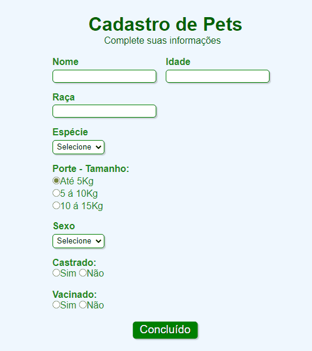

##Formulario-de-cadastro

Formulário de cadastro de animais, contém espaços para preenchimento de informações básicas sobre o pet e um botão para que essas informações sejam enviadas.

Tecnologias utilizadas:

- HTML
- CSS

[]
